<div align="center">
  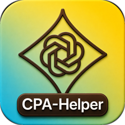
  <h1>CPA-Helper</h1>
  <p><strong>面向 CLIProxyAPI 的本地自托管多用户管理面板</strong></p>
  <p>用量统计 · 请求追踪 · 用户余额 · API 密钥管理 · 模型价格维护 · Codex 凭证巡检</p>
  <p>
    <a href="README.md">English</a>
    <span> · </span>
    <strong>中文</strong>
  </p>
  <p>
    <a href="https://go.dev/"></a>
    <a href="https://vuejs.org/"></a>
    <a href="https://vitejs.dev/"></a>
    <a href="LICENSE"></a>
    <a href="https://linux.do"></a>
  </p>
</div>

---

CPA-Helper 是面向 CLIProxyAPI / CPA 用户的本地自托管多用户管理面板，用于集中管理用量统计、请求明细、用户账号、API Key、模型价格、可用模型以及 Codex auth file 巡检维护。

它支持按用户隔离 API Key 与用量数据：每个用户都可以独立创建和管理自己的 Key，并查看属于自己的请求、Token 与费用统计；管理员可以创建或禁用普通用户账号，查看全局用量和用户维度明细，适合个人、小团队或共享 CPA 服务的内网场景。项目采用 Go + SQLite + Vue 3 + Vite 构建，默认将运行数据写入仓库根目录的 `data/` 目录。

需要说明的是，Agent 发起的模型请求仍由 Agent 直接发送到 CPA，CPA-Helper 不代理或中转这些请求；它只调用 CPA 的 usage 队列、API KEY 创建与删除、凭证管理等接口，用于用量查看、密钥管理和凭证维护。

## 目录

- [项目特点](#项目特点)
- [截图预览](#截图预览)
- [技术栈](#技术栈)
- [目录结构](#目录结构)
- [环境要求](#环境要求)
- [快速开始](#快速开始)
- [配置说明](#配置说明)
- [开发与检查](#开发与检查)
- [贡献](#贡献)
- [致谢](#致谢)
- [许可证](#许可证)

## 项目特点

- **用量统计与费用估算**：按全局、用户和当前账号视角统计请求数、Token、成功率、延迟、模型分布和费用，并提供趋势图、排行榜和筛选视图。
- **请求明细追踪**：管理员可按时间、用户、API Key 描述、服务商、模型、接口和失败状态筛选全局请求；普通用户只查看自己账号下的请求详情。
- **用户与权限管理**：支持管理员和普通用户视图，管理员可创建、禁用普通用户账号，并维护用户昵称、登录账号、密码和角色。
- **用户余额与 Key 自动暂停**：用户默认不限制余额；管理员可设置每月余额和不限时余额，用量按当前模型价格折算为 USD，优先扣每月余额，不足再扣不限时余额，余额耗尽后只暂停该用户的 CPA API Key。
- **API Key 生命周期管理**：每个用户都可以独立创建、编辑、复制和删除自己的 API Key，并同步到 CPA；用量会按用户维度独立统计和展示，每个 Key 都提供请求说明和真实请求测试。
- **模型价格维护**：Token 模型按 USD / 百万 Token 维护输入、输出、缓存价格；模型名包含 `image` 的模型按每次成功调用固定 USD 计费，并可对照 CPA 当前可用模型快速补齐或调整本地 LiteLLM / 手动价格。
- **可用模型聚合查询**：通过当前账号绑定的 CPA API Key 查询可用模型，并关联本地价格信息。
- **CLIProxyAPI / CPAMC 集成**：配置服务地址、管理密钥、usage 队列和本地采集参数，将远端 usage 事件落入本地 SQLite。
- **Codex auth file 巡检**：支持 Cron 调度、额度阈值、只检查不修改、按条件扫描、并发 Worker、优先级规则、账号启停和删除维护。
- **本地优先的数据策略**：默认使用 SQLite 和 `data/` 目录，支持通过 `CPA_HELPER_DATA_DIR` 覆盖运行数据路径。
- **现代化管理界面**：基于 Vue 3、Naive UI、ECharts 和 lucide 图标，支持浅色、暗色和跟随系统主题。

## 截图预览

### 管理端

**历史用量**

管理员可按时间、用户、模型和接口查看全局请求量、Token、费用、趋势和分布。

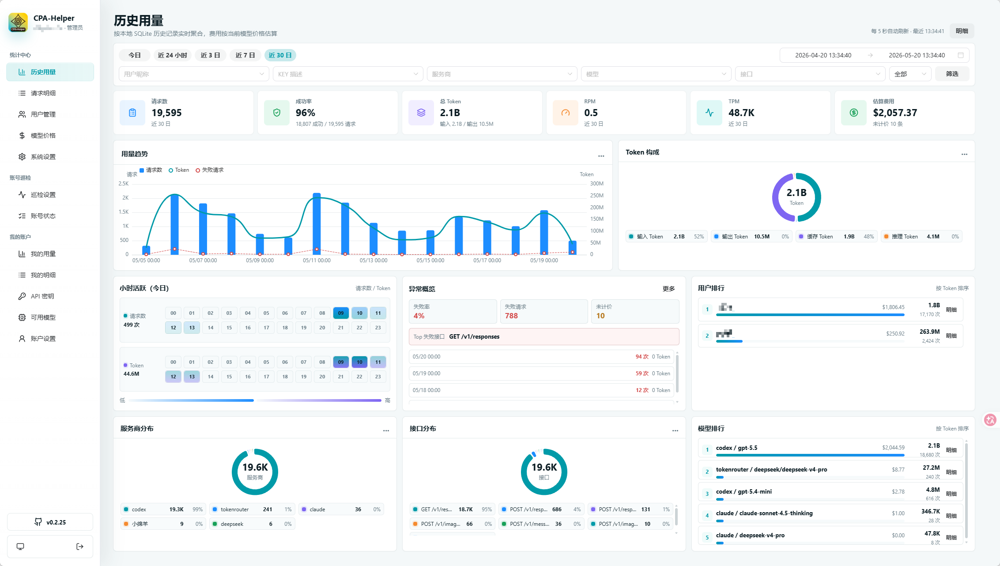

**请求明细**

管理员可筛选全局请求事件，普通用户可查看自己账号下的请求明细；详情以抽屉方式呈现。

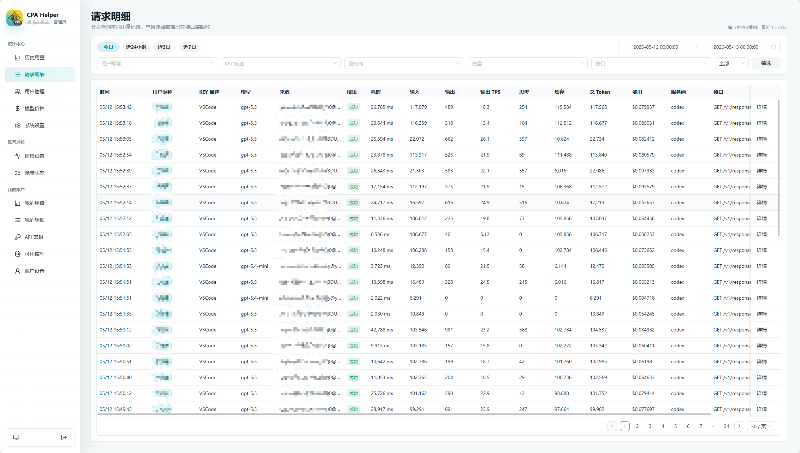

**用户管理**

管理员可创建或禁用普通用户账号，维护昵称、角色、启停状态，并查看用户维度的今日用量、每月余额和不限时余额。

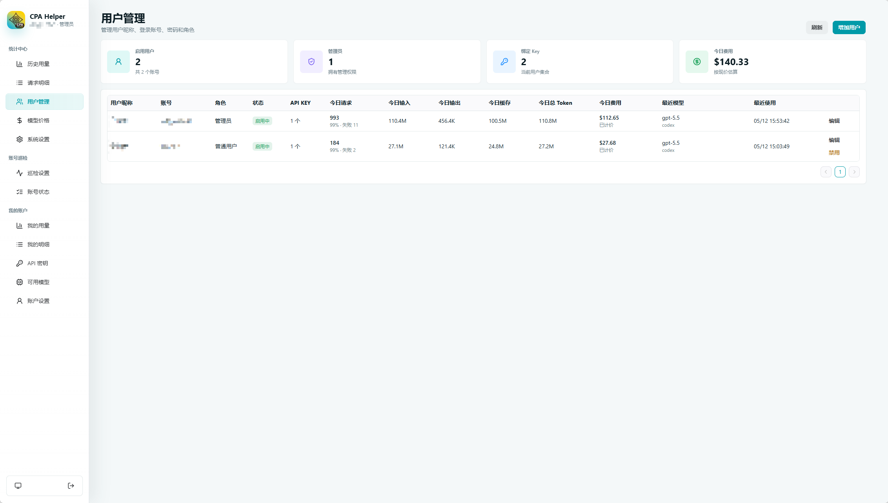

**模型价格**

查看 CPA 当前可用模型与本地价格库的差异，快速为未定价模型补价，并按当前价格实时估算历史请求费用。

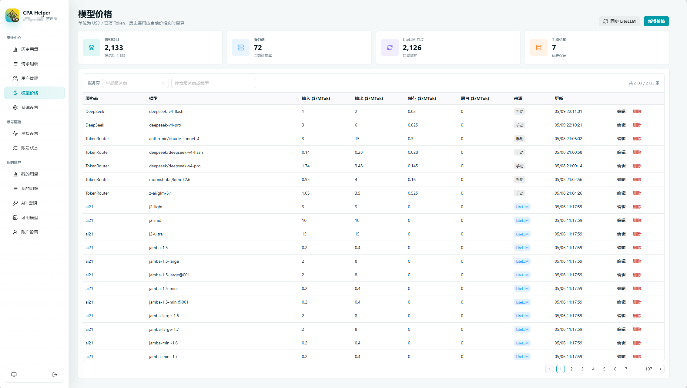

**系统设置**

集中配置 CLIProxyAPI / CPAMC 地址、模型请求地址、管理密钥、本地采集和轮询参数。

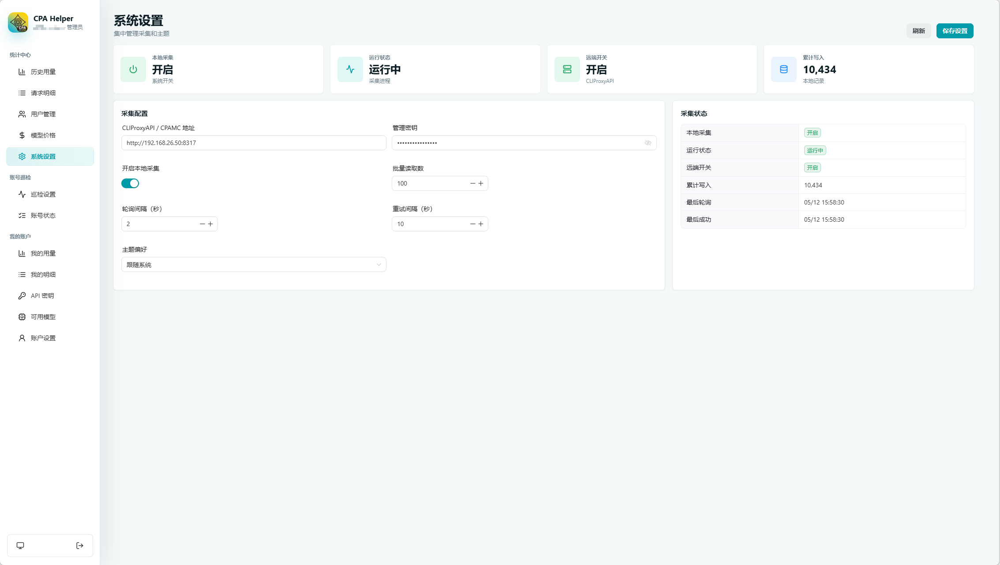

### 账号巡检

**巡检设置**

配置 Codex auth file 巡检的 Cron 调度、额度阈值、按条件扫描、超时、重试、Worker 数和优先级规则。

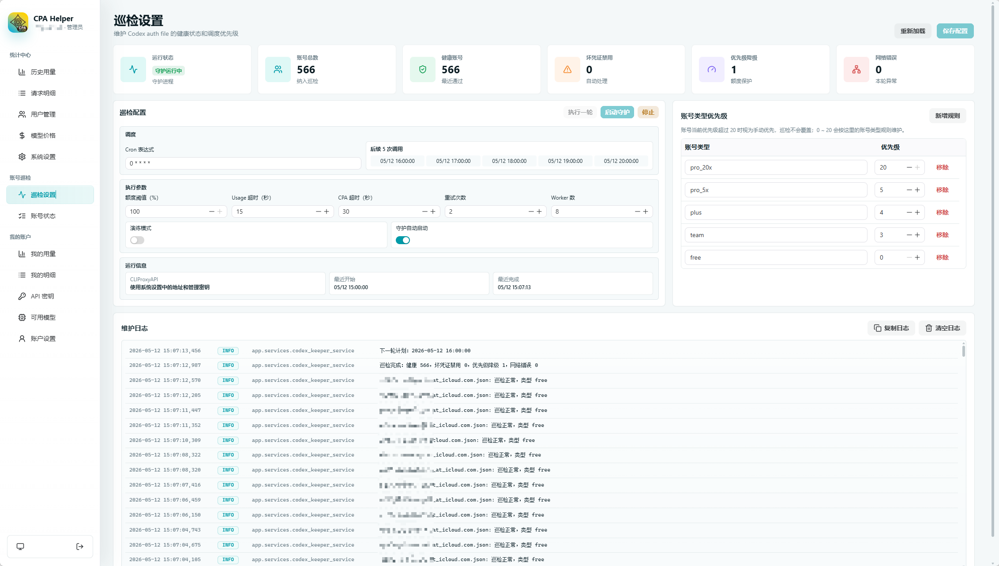

**账号状态**

查看 auth file 健康状态、额度窗口、账号类型、优先级和最近巡检维护结果。

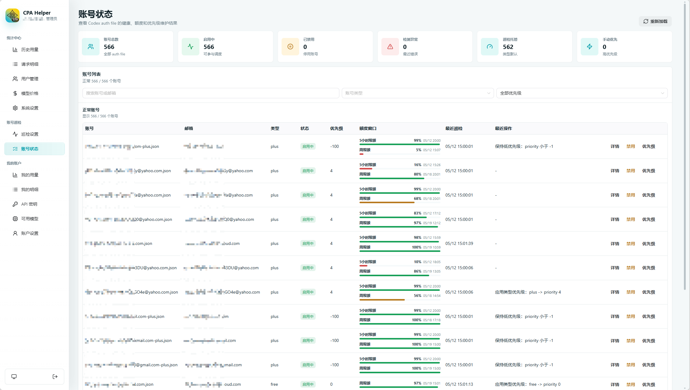

### 个人视图

**我的账户**

每个用户可查看自己的请求量、Token、费用、趋势、模型使用情况和当前余额状态。

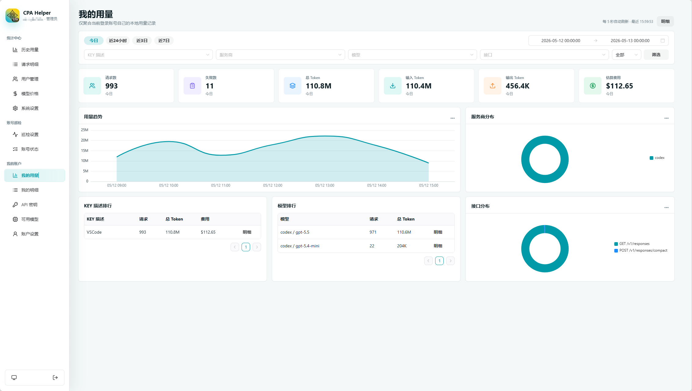

**我的明细**

每个用户可查看自己账号下的请求事件和详情，不与其他用户混在一起。

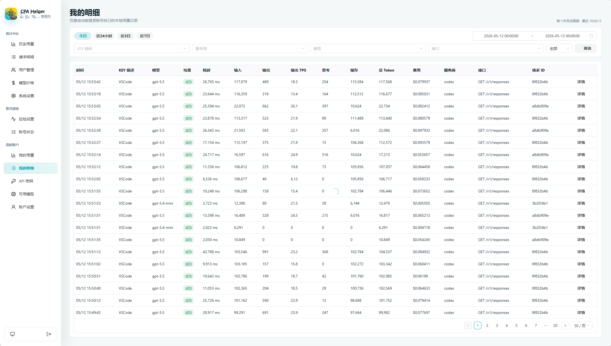

**API 密钥**

当前账号可独立创建和管理自己的 API Key，查看今日请求、Token、费用和余额概览，并对单个 Key 生成请求示例或发起真实请求测试。

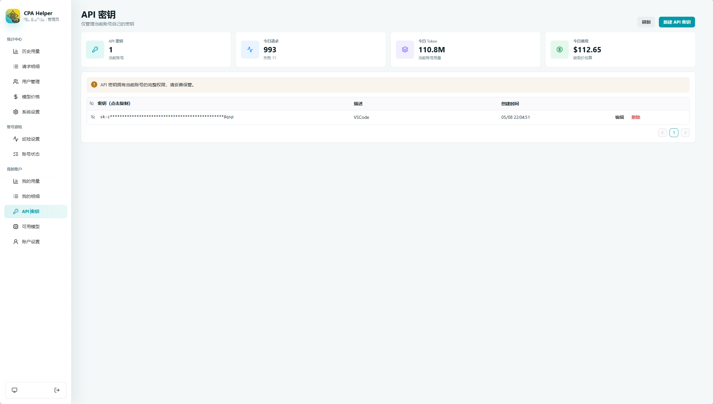

**可用模型**

通过绑定的 CPA API Key 查询可用模型，并展示模型可用状态与本地价格信息。

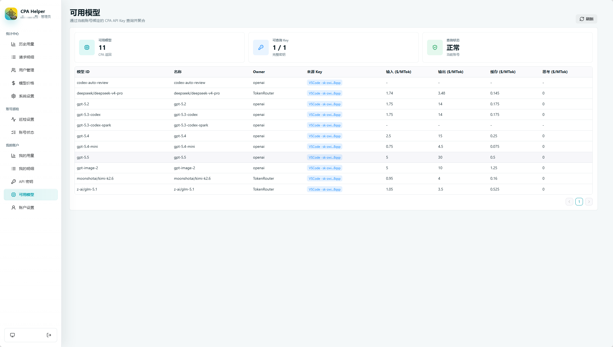

**账户设置**

查看当前登录账号并更新密码。

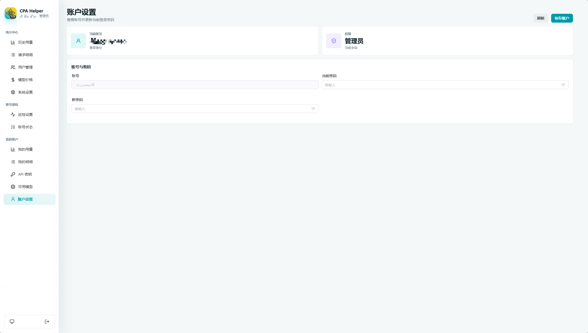

## 技术栈

- **后端**：Go 标准库 HTTP、SQLite、robfig/cron、modernc.org/sqlite。
- **前端**：Vue 3、Vite、TypeScript、Vue Router、Naive UI、ECharts、lucide-vue-next。
- **运行数据**：默认写入根目录 `data/`，SQLite 数据库位于 `data/db/cpa_helper.sqlite3`。
- **接口风格**：后端统一提供 `/api/*` 接口，前端开发服务器通过 Vite proxy 转发到 `http://127.0.0.1:18317`。

## 目录结构

```text
CPA-Helper/
├── backend/                 # Go 后端项目
│   ├── cmd/cpa-helper/      # 应用入口
│   ├── internal/app/        # 应用组合、路由、业务处理、数据库访问
│   ├── internal/httpserver/ # HTTP server 生命周期与优雅退出
│   ├── internal/platform/   # 外部系统基础设施适配
│   ├── internal/security/   # 密码、Session、API Key 安全工具
│   ├── migrations/          # 内嵌 goose SQLite 迁移
│   ├── go.mod
│   └── go.sum
├── frontend/                # Vue + Vite 前端项目
│   ├── src/                 # 应用、功能模块、共享组件与样式
│   ├── public/              # 静态资源
│   └── package.json         # 前端依赖与脚本
├── pictures/                # README 截图素材
├── docs/                    # 参考文档
├── data/                    # 运行时数据目录，默认不提交
├── VERSION                  # 应用版本号，Docker 标签和前端显示共用
├── README.md
├── README.zh-CN.md
└── LICENSE
```

## 环境要求

- Go 1.25 或更高版本。
- Node.js 20 或更高版本。
- npm。
- 一个可访问的 CLIProxyAPI / CPA 服务。默认地址为 `http://127.0.0.1:8317`。

## 快速开始

### 1. Docker Compose 部署（推荐）

在部署目录创建 `docker-compose.yml`：

```yaml
services:
  cpa-helper:
    image: ghcr.io/xialss/cpa-helper:latest
    container_name: cpa-helper
    restart: always
    # 如需改为bridge,需将容器内部端口 18317 映射至主机
    # 程序默认访问地址为 `http://127.0.0.1:18317`
    network_mode: host
    environment:
      - TZ=Asia/Shanghai
    volumes:
      - ./data:/app/data
```

然后直接拉取镜像并启动：

```powershell
docker compose pull
docker compose up -d
```

接管 fork 时，需要先发布 GHCR 镜像：可以在 `main` 分支更新 `VERSION`
触发，也可以在 GitHub Actions 页面手动运行 `Build and Release CPA-Helper`
workflow。已有 VPS 部署切换镜像行即可，继续保留同一个
`./data:/app/data` 挂载。

访问：

```text
http://127.0.0.1:18317
```

首次访问时，系统会引导创建第一个管理员账号。

### 2. 克隆项目

```powershell
git clone <your-repo-url>
cd CPA-Helper
```

### 3. 启动后端

所有后端命令都在 `backend/` 目录运行：

```powershell
cd backend
go mod download
go run ./cmd/cpa-helper
```

后端可执行文件也提供显式运维子命令：

```powershell
go run ./cmd/cpa-helper migrate  # 只运行数据库迁移并退出
go run ./cmd/cpa-helper serve    # 只在只读启动检查通过后启动服务
go run ./cmd/cpa-helper doctor   # 只运行只读启动检查并退出
```

不带子命令运行是面向用户的默认启动路径：先迁移数据库，再执行就绪检查，然后启动服务。

如需本地编译二进制，输出到已忽略的 `backend/bin/`：

```powershell
go build -o bin/cpa-helper.exe ./cmd/cpa-helper
```

后端健康检查：

```powershell
curl http://127.0.0.1:18317/api/health
```

预期返回：

```json
{"status":"ok"}
```

### 4. 启动前端开发服务器

新开一个终端，在 `frontend/` 目录运行：

```powershell
cd frontend
npm install
npm run dev
```

如果本机已经有正式后端占用 `18317`，可以把测试后端启动到其他端口，并让 Vite 代理到测试后端：

```powershell
$env:CPA_HELPER_PROXY_TARGET="http://127.0.0.1:18318"
npm run dev -- --host 127.0.0.1 --port 5174 --strictPort
```

打开浏览器访问：

```text
http://127.0.0.1:5173
```

首次访问时，系统会引导创建第一个管理员账号。

### 5. 单服务预览或部署

如果希望由 Go 后端托管前端静态文件，先构建前端：

```powershell
cd frontend
npm install
npm run build
```

然后启动后端：

```powershell
cd ../backend
go run ./cmd/cpa-helper
```

访问：

```text
http://127.0.0.1:18317
```

后端会在 `frontend/dist` 存在时托管构建后的单页应用。

## 配置说明

### CLIProxyAPI / CPAMC

进入“系统设置”页面后配置：

- **CLIProxyAPI / CPAMC 地址**：默认 `http://127.0.0.1:8317`。
- **模型请求地址**：只用于 API 密钥页“请求测试”生成 Base URL、接口 URL 和示例；不影响采集地址、管理密钥或后端同步逻辑。
- **管理密钥**：用于访问 CLIProxyAPI Management API。
- **开启本地采集**：启用后，CPA-Helper 会从 usage 队列读取事件并写入本地数据库。
- **批量读取数、轮询间隔、重试间隔**：控制本地采集任务的吞吐与失败重试。

### 用户余额

- 所有现有用户和新建用户默认“不限制余额”。
- 管理员可在“用户管理”里关闭不限制开关，并设置每月余额与不限时余额；两个数值默认 `0`，且不能留空。
- 首次设置余额不会追溯历史 usage，只有后续新采集入库的 usage 会参与扣费。
- 余额扣费使用当前模型价格估算的 USD 金额，顺序固定为先扣每月余额，不足部分再扣不限时余额。
- 当两类余额都不可用或耗尽时，系统会从 CPA 远端移除该用户本地绑定的 API Key，但不会禁用该用户登录账号；用户仍可登录查看原因。
- 每月余额按 `Asia/Shanghai` 自然月重置。进入新月份、管理员补充余额或重新打开不限制余额后，仅因余额耗尽暂停的 Key 会自动恢复。
- 未定价的 usage 不扣余额，但会记录未定价事件，并在管理员和用户自己的余额状态里提示。

### 模型价格与请求测试

- “模型价格”页会同时展示 CPA 当前可用模型和本地价格库记录，方便发现未定价模型。
- Token 模型按 USD / 百万 Token 维护输入、输出、缓存读、缓存写价格；模型名包含 `image` 的模型按每次成功调用固定 USD 计费，未设置每次价格时会被视为未定价。
- 历史用量页面会按当前价格实时重算展示费用；已经写入的余额扣费流水保留当时计算出的金额，不会因后续改价回算。
- LiteLLM 同步用于快速补齐价格库，手动价格会优先保留；无法访问 GitHub 时可在模型价格页配置 LiteLLM 代理。
- API 密钥页每个 Key 都提供“请求测试”，弹窗会展示 Base URL、接口 URL、鉴权 Header、curl 示例，并可真实发送一次测试请求。
- 请求测试支持 Chat Completions、Responses 和 Claude Messages 三种接口格式，示例和测试请求会随选择自动切换。

### 数据目录

默认运行数据目录：

```text
data/
```

默认 SQLite 数据库：

```text
data/db/cpa_helper.sqlite3
```

可以通过环境变量覆盖运行数据目录：

```powershell
$env:CPA_HELPER_DATA_DIR="<your-data-dir>"
```

然后再启动后端服务。

### 账号巡检

“巡检设置”页面用于维护 Codex auth file：

- Cron 表达式决定自动巡检周期。
- 额度阈值决定何时降级或恢复账号优先级。
- “只检查不修改”开启时只记录计划操作，不会禁用账号或调整优先级。
- 按条件扫描会对比本地已记录账号与 CPA 当前账号列表：本地缺少的账号会先请求一次额度并记录，本地多出的账号会移除。
- 优先级规则按账号类型控制默认调度权重。
- “账号状态”页面可查看健康、额度、最近巡检、启停状态和手动优先级。

## 开发与检查

### 本地隔离测试

如果本机已经运行正式服务，测试时不要复用正式端口和真实数据目录。建议后端使用临时端口和临时数据目录：

```powershell
cd backend
$env:CPA_HELPER_ADDR=":18318"
$env:CPA_HELPER_DATA_DIR="$env:TEMP\cpa-helper-test-data"
go run ./cmd/cpa-helper
```

前端测试服务使用独立端口，并把 Vite 代理指向测试后端：

```powershell
cd frontend
$env:CPA_HELPER_PROXY_TARGET="http://127.0.0.1:18318"
npm run dev -- --host 127.0.0.1 --port 5174 --strictPort
```

自动化验证默认不要使用真实 CPA 地址和真实管理密钥。涉及自动巡检、账号启停、优先级调整或删除操作时，应使用假的 CLIProxyAPI / CPAMC 测试替身，并优先开启“只检查不修改”；只有明确确认风险后才连接真实 CPA。

### 版本管理

项目版本统一写在根目录 `VERSION` 文件中，例如 `0.1.0`。`VERSION` 在 `main` 分支变化时，GitHub Actions 会读取它并推送 `ghcr.io/xialss/cpa-helper:v0.1.0` 和 `ghcr.io/xialss/cpa-helper:latest`；同一个 workflow 也可以手动运行，用于发布当前版本。前端构建也会读取同一个文件并显示为 `v0.1.0`。GHCR 包按公开包使用，Docker Compose 部署默认不需要 `docker login ghcr.io`。

后端：

```powershell
cd backend
go fmt ./...
go test ./...
```

前端：

```powershell
cd frontend
npm run lint
npm run build
```

数据库结构：

```powershell
cd backend
go test ./...
```

Go 后端可执行文件提供 `migrate`、`serve` 和 `doctor` 子命令。不带子命令的默认启动路径会先运行内嵌 goose SQLite 迁移再启动服务；`serve` 只执行只读启动检查，数据库缺失或版本落后时会直接失败。迁移文件位于 `backend/migrations/`，不再需要 Alembic。
Docker 升级时只需要继续挂载旧的 `data/db/cpa_helper.sqlite3`；迁移逻辑已经随 Go 二进制打包，不会读取旧源码目录。

## 贡献

欢迎提交 Issue 和 Pull Request。建议在提交前完成以下检查：

- 后端通过 `go fmt ./...` 和 `go test ./...`。
- 前端通过 `npm run lint` 和 `npm run build`。
- 涉及关系型数据库结构变化时，同步新增或更新 `backend/migrations/` 下的 goose 迁移。
- 不提交本地运行数据、虚拟环境、构建产物或密钥。

## 致谢

感谢 [Linux.do](https://linux.do/) 站点及其社区为项目开发与交流提供支持与启发。

## 许可证

本项目基于 [MIT License](LICENSE) 开源。
